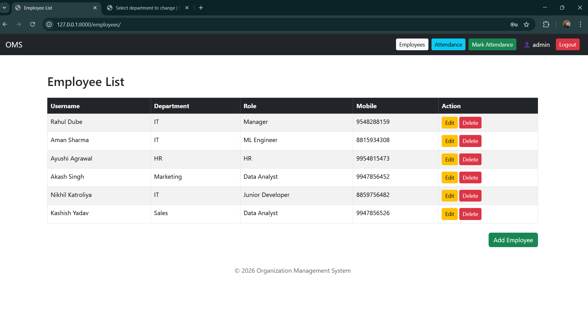
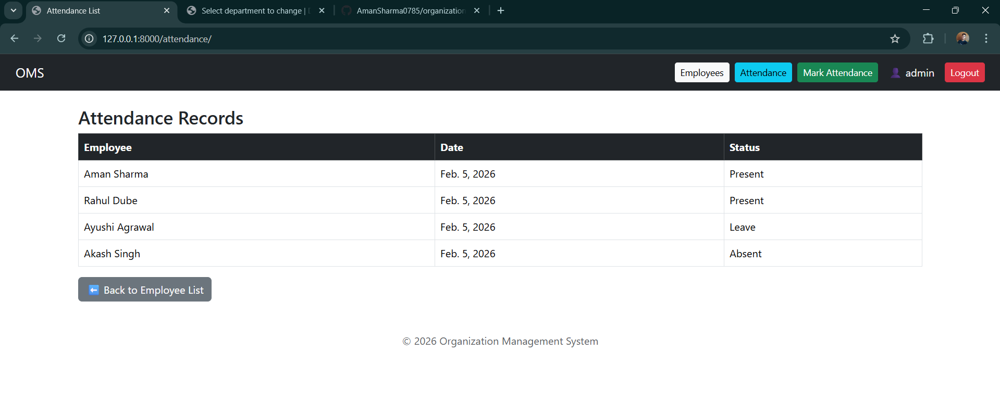
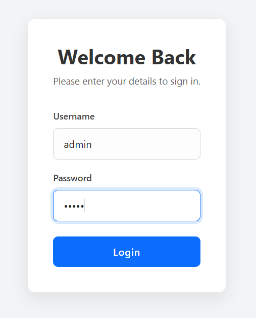
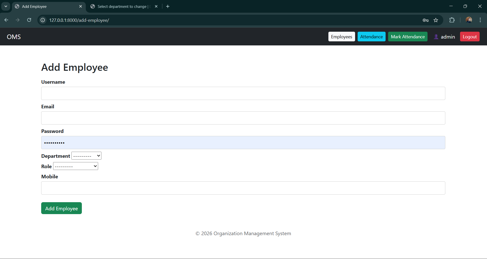
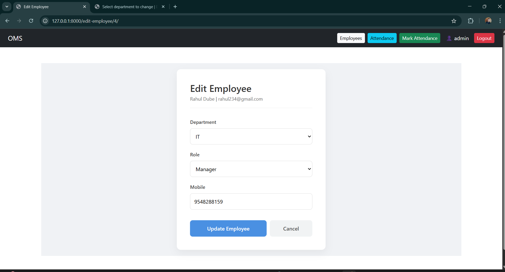
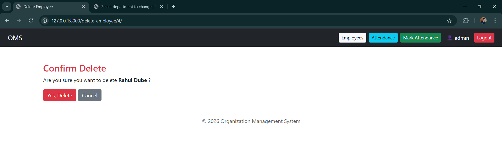
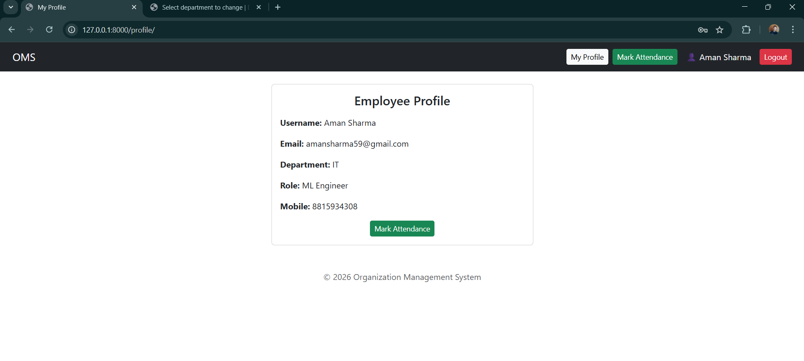
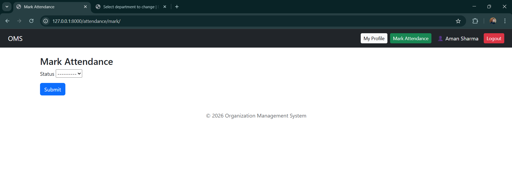

# Organization Management System (OMS)

A **role-based Organization Management System** built using **Django (Python)** that allows admins to manage employees and attendance, while employees can securely access their profile and mark daily attendance.

This project follows **real-world architecture**, clean code practices, and proper **access control**.

---

## Features

### Admin (Superuser)
- Login / Logout

- Manage Employees (CRUD)
  - Add Employee
    
  - Edit Employee
  
  - Delete Employee
 
- View All Employees
- View Attendance of All Employees
- Secure admin-only access

### Employee (Normal User)
- Login / Logout
- View Own Profile

- Mark Daily Attendance (Present / Absent / Leave)
 
- Cannot access admin pages
- No “Access Denied” errors (Smart Redirect UX)

---

## Tech Stack

- **Backend:** Django 5.1.3 (Python)
- **Frontend:** HTML, Bootstrap 5
- **Database:** SQLite (default)
- **Authentication:** Django Auth System

---

## 📁 Project Structure

organization_ms/
│
├── accounts/
│ ├── migrations/
│ ├── templates/
│ │ └── accounts/
│ │ ├── base.html
│ │ ├── login.html
│ │ ├── employee_list.html
│ │ ├── add_employee.html
│ │ ├── edit_employee.html
│ │ ├── delete_employee.html
│ │ ├── employee_profile.html
│ │ ├── attendance_list.html
│ │ └── mark_attendance.html
│ ├── models.py
│ ├── views.py
│ ├── forms.py
│ └── urls.py
│
├── organization_ms/
│ ├── settings.py
│ ├── urls.py
│
├── db.sqlite3
├── manage.py
└── README.md
---

## Database Models

### EmployeeProfile
- user (OneToOneField → Django User)
- department
- role
- mobile

### Attendance
- employee (ForeignKey)
- date
- status (Present / Absent / Leave)

---

## Authentication & Authorization

- Django built-in authentication
- Custom `admin_required` decorator
- Smart redirect instead of 403 errors
- Secure role-based page access

---

## Smart UX Flow

### Employee Login
**Login → Employee Profile → Mark Attendance → Logout**

### Admin Login
**Login → Admin Dashboard → Manage Employees / View Attendance → Logout**

